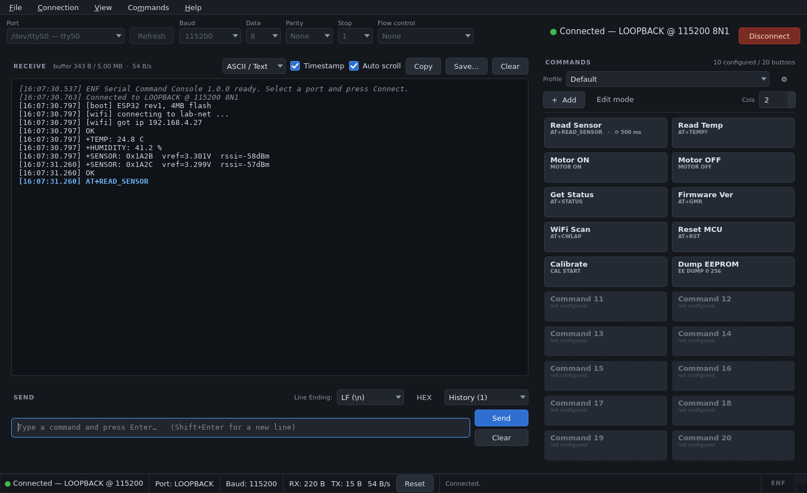
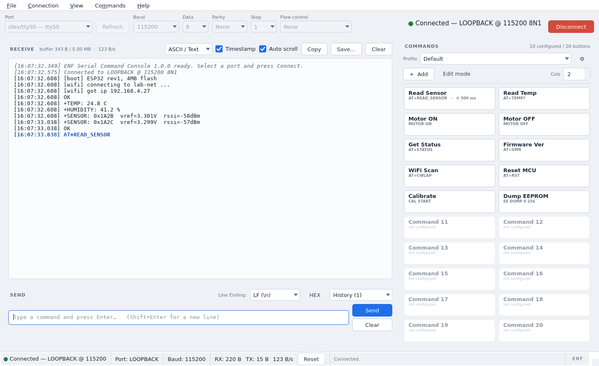

# ENF Serial Command Console

<sub>An **ENF** project · MIT licensed · [github.com/hamid-enf/Serial_App](https://github.com/hamid-enf/Serial_App)</sub>

A professional serial terminal for Windows (and Linux/macOS), built as a replacement for the
Arduino IDE Serial Monitor. Its defining feature is a panel of **saved command buttons**: the
commands you type ten times an hour become one-click buttons with their own name, payload,
line ending and optional auto-repeat.



<details>
<summary>Light theme</summary>


</details>

---

## Contents

- [Why this exists](#why-this-exists)
- [Features](#features)
- [Download and install](#download-and-install)
- [Running from source](#running-from-source)
- [Usage guide](#usage-guide)
- [Keyboard shortcuts](#keyboard-shortcuts)
- [Configuration and data locations](#configuration-and-data-locations)
- [Project structure](#project-structure)
- [Architecture](#architecture)
- [Testing](#testing)
- [Building the Windows executable](#building-the-windows-executable)
- [Troubleshooting](#troubleshooting)
- [Design notes and deliberate deviations](#design-notes-and-deliberate-deviations)
- [Licence](#licence)

---

## Why this exists

Working with an STM32, ESP32, Arduino, GPS module or any AT-command modem means sending the
same handful of strings over and over: `AT+GMR`, `AT+CWLAP`, `MOTOR ON`, `CAL START`. The stock
Serial Monitor makes you retype every one of them, forgets your settings between sessions and
freezes when a device floods the port.

This tool fixes exactly that:

| Pain point | Serial Command Console |
| --- | --- |
| Retyping the same commands | 20 configurable command buttons by default, unlimited in practice, in a scrollable panel |
| One project's settings at a time | Named **profiles** (STM32 / ESP32 / GPS …) with import and export |
| UI freezes on high-rate data | Serial I/O runs on its own thread; the UI is fed batched updates at ~30 Hz |
| Cryptic tracebacks | Every failure becomes a plain-English message with a suggested fix |
| Nothing is remembered | Ports, baud, buttons, theme, window layout and terminal preferences all persist |

---

## Features

**Connection**
- Port picker with live enumeration (`Refresh`, `Ctrl+R`) showing the device description
- Baud rates 300 → 2 000 000 plus free-text custom values
- Data bits (5/6/7/8), parity (None/Even/Odd/Mark/Space), stop bits (1/1.5/2)
- Flow control: None, RTS/CTS (hardware), XON/XOFF (software)
- DTR/RTS initial state, read/write timeouts
- One-click Connect/Disconnect with a coloured status indicator

**Receive panel**
- Real-time output with auto-scroll that you can toggle (and which pauses when you scroll up)
- Per-line timestamps, distinct RX/TX colouring, plus an italic style for app notices
- Display modes: ASCII/Text, Hex, and Hex+ASCII side by side
- Copy, Select All, Clear, and Save to **TXT**, **CSV** (timestamp, direction, text, hex) or **raw binary**
- Configurable buffer ceiling — 1 / 5 / 10 / 50 MB — trimmed from the oldest end without stalling

**Send panel**
- Single-line input with Enter to send, Shift+Enter for a newline
- HEX mode: type `48 65 6C 6C 6F` (or `0x48,0x65`) and the raw bytes go on the wire
- Line ending selector: None / LF / CR / CRLF, applied to typed sends *and* command buttons
- Command history with Up/Down arrows, a dropdown, de-duplication and a configurable bound

**Command buttons — the headline feature**
- Default 20; add as many as you like; the panel scrolls and the column count is adjustable
- Per button: name, command, line ending (inherit or override), HEX mode, enabled flag,
  optional description (tooltip) and auto-send interval
- Single click sends; **Ctrl+Click**, right-click → *Edit*, or **Edit mode** opens the editor
- Add, Edit, Delete, Duplicate, Rename, Reset, Move Up/Down and **drag-and-drop reordering**
- **Auto-repeat**: any button can fire on a timer (≥ 20 ms) with a visible "repeating" state;
  `Ctrl+Shift+S` stops every running job
- A brief flash and status-bar note confirm each send

**Profiles**
- Create, Rename, Duplicate, Delete, Import and Export (`.json`)
- Each profile owns its buttons, its serial settings and its own command history
- Switching profiles is instant and is remembered across restarts

**Robustness**
- Serial reads/writes never touch the GUI thread; the RX path is bounded and drops the *oldest*
  data under sustained overload rather than growing without limit
- Sudden unplug, port-in-use, permission-denied, write timeout and configuration errors all
  surface as friendly messages, e.g.
  *"Unable to open COM5. The port may be in use by another application."*
- Corrupt `config.json` is quarantined with a timestamp, the last good `.bak` is tried, and the
  app still starts with defaults — it never refuses to launch
- Rotating log file plus an in-app log viewer (Help → Application Log)

**Appearance**
- Hand-written Dark and Light Qt stylesheets, switchable with `Ctrl+T` and persisted
- Configurable terminal font family and size
- Window geometry, splitter position and panel layout restored on start

---

## Download and install

Windows builds are produced by GitHub Actions on a real `windows-latest` runner.

1. Open the [Actions tab](../../actions/workflows/build-windows.yml) (or the
   [Releases page](../../releases) for tagged versions).
2. Download one of:
   - **`SerialCommandConsole-portable.exe`** — a single file, no installation, no admin rights.
   - **`SerialCommandConsole-installer`** — Inno Setup installer with Start-menu and optional
     desktop shortcuts, plus an optional *portable mode* tick-box.
   - **`SerialCommandConsole-windows-folder.zip`** — the unpacked build; starts faster than the
     one-file version because nothing has to be extracted to `%TEMP%` on launch.
3. Run it. Windows SmartScreen may warn about an unsigned binary — *More info → Run anyway*.
   (The project ships no code-signing certificate; signing is a paid, identity-bound service.)

Requirements: Windows 10 or 11, 64-bit. No Python installation is needed for the frozen builds.

---

## Running from source

Works on Windows, Linux and macOS with Python 3.10+.

```bash
git clone https://github.com/hamid-enf/Serial_App.git
cd Serial_App

python -m venv .venv
# Windows
.venv\Scripts\activate
# Linux / macOS
source .venv/bin/activate

pip install -r requirements.txt
python main.py
```

Useful flags:

```bash
python main.py --demo                # in-process loopback port; no hardware needed
python main.py --verbose             # debug logging, mirrored to the console
python main.py --config path.json    # use an alternative configuration file
python main.py --selftest            # build the UI headlessly, verify resources, exit
python main.py --version
```

On a bare Linux box Qt also needs the usual X libraries
(`libegl1 libgl1 libxkbcommon-x11-0 libxcb-cursor0 …`); see `.github/workflows/tests.yml` for
the exact list used in CI.

---

## Usage guide

### Connect

1. Pick the port. `Refresh` (`Ctrl+R`) re-enumerates; each entry shows the device description
   so `COM7 — USB-SERIAL CH340` is easy to spot.
2. Choose the baud rate (or type a custom one) and adjust framing if your device is unusual.
3. Press **Connect** (`Ctrl+Enter`). The indicator turns green and the status bar shows
   `Port · Baud · RX/TX byte counters · throughput`.

### Send a command

Type into the input box and press **Enter**. The chosen **Line Ending** is appended — this is
the setting that decides whether an Arduino `Serial.readStringUntil('\n')` ever returns.

### Set up a command button

1. **Ctrl+Click** any button (or right-click → *Edit*, or switch on *Edit mode* and click).
2. Fill in the name and command. Optionally override the line ending, enable HEX mode, add a
   description or set an auto-send interval.
3. The dialog shows a live preview of the exact bytes that will be transmitted, e.g.
   `AT+GMR␍␊ → 41 54 2B 47 4D 52 0D 0A (8 bytes)`.
4. Save. The button is written to `config.json` immediately.

Reorder buttons by dragging them, or with right-click → *Move Up / Move Down*.

### Auto-repeat

Set an interval in the button editor and click the button's repeat control (or the context
menu → *Start Auto-Send*). The button shows a pulsing "repeating" state. `Ctrl+Shift+S` stops
everything. The scheduler lives on the GUI thread's timer loop but hands payloads to the serial
thread through the same bounded queue as manual sends, so a fast repeat can never outrun the
port and blow up memory — it back-pressures and tells you.

### Profiles

`File → Profiles…` (`Ctrl+P`) to create, rename, duplicate, delete, import or export. Export
writes a self-describing JSON document:

```json
{
  "kind": "serial-command-console.profile",
  "version": 1,
  "profile": { "name": "ESP32", "buttons": [ … ], "serial": { … } }
}
```

Importing re-keys every ID, so importing a profile you already have never clashes.

### Export a session

`File → Save Receive Log…` (`Ctrl+S`) writes the buffer as:
- **`.txt`** — exactly what the terminal shows, honouring your timestamp and display-mode settings
- **`.csv`** — `timestamp_iso,direction,text,hex` for spreadsheets and log analysis
- **`.bin`** — the raw bytes, byte-for-byte as received (RX only, TX only, or both)

---

## Keyboard shortcuts

| Shortcut | Action |
| --- | --- |
| `Enter` | Send the input box |
| `Shift+Enter` | Newline inside the input box |
| `↑` / `↓` | Previous / next command from history (input box focused) |
| `Ctrl+Enter` | Connect / Disconnect |
| `Ctrl+R` | Refresh the port list |
| `Ctrl+L` | Clear the receive panel |
| `Ctrl+K` | Clear the input box |
| `Ctrl+A` | Select all terminal text |
| `Ctrl+Shift+C` | Copy the terminal contents |
| `Ctrl+Shift+A` | Toggle auto-scroll |
| `Ctrl+T` | Toggle dark / light theme |
| `Ctrl+N` | Add a command button |
| `Ctrl+Shift+S` | Stop all auto-send jobs |
| `Ctrl+S` | Save the receive log |
| `Ctrl+P` | Profiles dialog |
| `Ctrl+,` | Settings dialog |
| `F1` | Shortcut reference |
| `Ctrl+Click` a button | Edit that command button |

---

## Configuration and data locations

Everything lives in one human-readable JSON file.

| Platform | Location |
| --- | --- |
| Windows | `%APPDATA%\SerialCommandConsole\config.json` |
| Linux | `~/.config/SerialCommandConsole/config.json` |
| macOS | `~/Library/Application Support/SerialCommandConsole/config.json` |

Alongside it: `logs/` (rotating application log) and `profiles/` (default folder for
import/export).

Two overrides:
- Set `SERIAL_CONSOLE_HOME` to relocate the whole data directory (used by the test suite).
- Drop an empty **`portable.txt`** next to the `.exe` and settings move to a `data\` folder
  beside the program — the USB-stick scenario. The installer can do this for you.

**Corruption handling.** Saves are atomic (write to `.tmp`, `os.replace`) and the previous file
is kept as `config.json.bak`. If the JSON is unreadable at startup, it is moved aside as
`config.corrupt-<timestamp>.json` (at most six are kept), the `.bak` is tried, and failing that
the app starts with defaults and tells you what happened in a dismissible banner. The file also
carries a `schema_version`, and older layouts are migrated forward on load.

---

## Project structure

```
Serial_App/
├── main.py                     # thin entry point → serial_console.app:main
├── requirements.txt            # runtime dependencies
├── requirements-dev.txt        # + pytest, pyinstaller, ruff, mypy
├── pyproject.toml              # packaging, pytest, ruff and mypy configuration
│
├── serial_console/
│   ├── app.py                  # bootstrap: logging, config, theme, window, --selftest
│   ├── models/                 # dataclasses and enums — no I/O, no Qt
│   │   ├── enums.py            # LineEnding, Parity, StopBits, DisplayMode, Theme, …
│   │   ├── command.py          # CommandButton, AutoSendSpec
│   │   ├── profile.py          # Profile
│   │   ├── settings.py         # SerialSettings, TerminalSettings, AppConfig
│   │   └── errors.py           # domain exceptions
│   ├── core/                   # pure logic — importable and testable without Qt
│   │   ├── codec.py            # hex parsing/formatting, payload construction
│   │   ├── commands.py         # CommandStore: CRUD, ordering, validation
│   │   ├── profiles.py         # ProfileManager: lifecycle, import/export
│   │   ├── history.py          # bounded command history with cursor semantics
│   │   ├── terminal_buffer.py  # chunk store + renderer + exporters
│   │   ├── rx_aggregator.py    # thread-safe, bounded RX coalescing
│   │   ├── serial_worker.py    # the reader/writer thread
│   │   ├── stats.py            # byte counters and throughput
│   │   ├── errors.py           # exception → friendly UserError mapping
│   │   └── logging_setup.py    # rotating file + in-memory ring for the viewer
│   ├── transport/              # pluggable byte pipes
│   │   ├── base.py             # Transport protocol
│   │   ├── serial_transport.py # pyserial implementation
│   │   ├── loopback.py         # virtual port for tests, --demo and screenshots
│   │   └── ports.py            # port enumeration
│   ├── config/                 # persistence
│   │   ├── paths.py            # per-platform locations, portable mode
│   │   ├── store.py            # atomic save, backup, quarantine, recovery
│   │   └── migrations.py       # schema upgrades
│   ├── services/               # Qt-aware glue between core and UI
│   │   ├── serial_service.py   # owns the worker, drains it on a GUI timer, emits signals
│   │   └── autosend.py         # auto-repeat scheduler
│   └── ui/
│       ├── main_window.py      # composition root for the UI
│       ├── theme.py            # stylesheet loading and palette
│       ├── widgets/            # connection bar, terminal view, send panel,
│       │                       # command panel/button, status bar
│       └── dialogs/            # command editor, settings, profiles, log viewer
│
├── resources/
│   ├── themes/{dark,light}.qss
│   └── icons/                  # app icon (.ico/.png) and widget glyphs
│
├── tests/                      # 358 tests, no hardware required
├── scripts/
│   ├── screenshot.py           # regenerates the README images headlessly
│   └── make_icon.py            # regenerates the ENF app icon (.ico + .png)
├── packaging/                  # PyInstaller spec, build.bat, build.ps1, installer.iss
├── docs/images/                # README screenshots
└── .github/workflows/          # tests.yml (Linux+Windows) and build-windows.yml
```

> **Note on `packaging/` vs `build/`.** The specification suggested a `build/` folder for the
> build scripts. `build/` is the conventional *output* directory for Python packaging tools
> (and is in `.gitignore` for that reason), so putting hand-written scripts there invites them
> to be wiped by a stray `rm -rf build`. The scripts live in `packaging/` and write their output
> to `packaging/build/` and `packaging/dist/`.

---

## Architecture

Six layers, each depending only on the ones above it:

```
        models/          dataclasses + enums          (no I/O, no Qt)
           ▲
        core/            business logic               (no Qt)
           ▲
   transport/ config/    I/O boundaries               (pyserial, filesystem)
           ▲
       services/         Qt signals, threading glue
           ▲
          ui/            widgets and dialogs
           ▲
         app.py          composition root
```

`core/` and `models/` never import Qt, which is why the bulk of the test suite runs in under a
second with no event loop.

### The threading model

```
┌─────────────────────────── GUI thread ───────────────────────────┐
│  MainWindow ── SerialService ──┬── QTimer (33 ms) ── drain ───┐   │
│                                │                             ▼   │
│                                │                    TerminalBuffer│
└────────────────────────────────┼──────────────────────────────────┘
                                 │ thread-safe queues
┌────────────────────────────────┼──────────────────────────────────┐
│  SerialWorker (threading.Thread)                                  │
│    while not stop_event:                                          │
│        data = transport.read(...)   ← blocking, releases the GIL   │
│        rx_aggregator.push(data)                                   │
│        drain tx_queue → transport.write(...)                      │
└───────────────────────────────────────────────────────────────────┘
```

Key decisions, and the reasoning behind them:

- **A blocking read loop, not polling.** pyserial is a synchronous API. A dedicated thread
  blocking in `read()` with a short timeout releases the GIL and wakes the instant bytes arrive;
  a polling timer would add latency and burn CPU for nothing.
- **`RxAggregator` between the threads.** The worker pushes every read into a lock-protected
  accumulator with a hard byte ceiling; the GUI drains it every 33 ms. One signal per frame
  instead of one per read means a 2 Mbaud firehose costs the UI ~30 updates a second. When the
  ceiling is hit the *oldest* bytes are dropped and counted — bounded memory beats a graceful
  death.
- **Signals, not shared state.** `SerialService` is the only Qt-aware component that talks to
  the worker; the UI sees `dataReceived`, `connected`, `disconnected` and `errorRaised`.
- **`TerminalBuffer` is the source of truth**, not the `QTextEdit`. It stores `(direction,
  bytes, timestamp)` chunks, so switching to hex, toggling timestamps or exporting to CSV
  re-renders from real data rather than scraping the widget. Two independent flood guards apply:
  a byte budget (your 1–50 MB setting) and a hard block cap on the widget itself.
- **Exactly one `CLOSED` event.** A cable pulled out while the user clicks Disconnect is a real
  race; the worker and `stop()` both try to end the session and an atomic flag decides which one
  emits the event, so the UI can never double-handle a disconnect.
- **Errors funnel through `core/errors.map_*`.** Every `SerialException`, `OSError` and
  `PermissionError` is translated once, into a `UserError` with a message, a hint and a severity.
  No raw exception text ever reaches a dialog.

---

## Testing

```bash
pip install -r requirements-dev.txt
pytest tests -q                                    # 358 tests, ~20 s
pytest tests -q --cov=serial_console --cov-report=term-missing
pytest tests -m "not gui" -q                       # skip the Qt tests

ruff check serial_console tests main.py scripts    # lint
mypy serial_console                                # types: clean, 48 files
```

Line coverage of the non-UI code is **90%**; CI fails the build below 85%.

No hardware is needed: `LoopbackTransport` is a virtual port that can echo, script responses
and inject faults (`fail_on_open`, `fail_on_read`, `fail_on_write`) so every error path is
exercised deterministically. GUI tests run offscreen (`QT_QPA_PLATFORM=offscreen`), which is
also how CI runs them.

Coverage by area:

| File | What it proves |
| --- | --- |
| `test_codec.py` | Hex parse/format, line-ending application, payload construction |
| `test_commands.py` | Button CRUD, ordering, reordering, validation, serialisation |
| `test_history.py` | Newest-first ordering, de-duplication, bounds, cursor behaviour |
| `test_profiles.py` | Lifecycle, duplicate names, import/export re-keying, bad files |
| `test_config_store.py` | Atomic writes, `.bak`, corruption→quarantine→defaults, migrations |
| `test_serial_settings.py` | Validation and the full mapping to pyserial constants |
| `test_serial_worker.py` | Lifecycle, a 1 MiB burst arriving intact, back-pressure, fault paths |
| `test_buffers.py` | Aggregator ceiling and concurrency; buffer trimming, rendering, exports |
| `test_errors.py` | The exact user-facing wording of every error, and that no traceback leaks |
| `test_gui.py` | Service plumbing, auto-send, main-window behaviour, dialogs, a 1 MiB flood |
| `test_transport.py` | Settings → pyserial kwargs, open/close/read/write, driver misbehaviour, port enumeration and natural sorting |
| `test_paths_and_logging.py` | Every platform's data directory, portable mode, log rotation, read-only install |
| `test_app.py` | CLI parsing, the excepthook, and a real headless boot via `--selftest` |
| `test_branding.py` | The ENF marks in the UI, the version resource, the installer and the icon |

---

## Building the Windows executable

### Option A — GitHub Actions (recommended)

`.github/workflows/build-windows.yml` runs on `windows-latest` for every push and produces the
portable `.exe`, the zipped folder build and the Inno Setup installer as downloadable artifacts.
Push a `v*` tag and the same three files are attached to a GitHub release:

```bash
git tag v1.0.0 && git push origin v1.0.0
```

The workflow also runs the test suite and executes the frozen binary with `--selftest`, so a
missing hidden import or an unbundled resource fails the build instead of reaching a user.

> **Enabling the workflows.** `.github/workflows/build-windows.yml` and `tests.yml` exist in the
> working tree but are **not committed**: GitHub refuses any push that adds or edits a workflow
> file unless the pushing credential holds the `workflows` permission, which the automation
> account used here does not. To turn CI on, commit them from a clone you own:
>
> ```bash
> git add .github/workflows && git commit -m "Add CI workflows" && git push
> ```

### Option B — locally on Windows

```bat
packaging\build.bat                 :: venv + tests + freeze
packaging\build.bat /installer      :: also compile the Inno Setup installer
packaging\build.bat /skiptests      :: skip pytest
packaging\build.bat /usevenv        :: build inside the venv you already activated
packaging\build.bat /clean          :: recreate .build-venv from scratch
```

or, in PowerShell:

```powershell
.\packaging\build.ps1
.\packaging\build.ps1 -Installer
.\packaging\build.ps1 -SkipTests -Clean
.\packaging\build.ps1 -UseVenv
```

The scripts look for an interpreter in this order: the **currently activated virtual
environment**, `python`, `python3`, `py -3`, then the default install locations. The `py`
launcher is deliberately tried *last* — it is often present with no registered runtime (a
Microsoft Store install, or a leftover from an uninstall) and then fails with *"No suitable
Python runtime found"* even though `python.exe` works perfectly well.

After freezing, the script runs the new executable with `--selftest`, so a missing data file
or hidden import fails the build instead of reaching a user.

Prerequisites: Python 3.10+ reachable by one of the routes above, and
[Inno Setup 6](https://jrsoftware.org/isdl.php) if you want the installer. Output:

| Artefact | Path |
| --- | --- |
| Portable single file | `packaging\dist\SerialCommandConsole-portable.exe` |
| Folder build | `packaging\dist\SerialCommandConsole\SerialCommandConsole.exe` |
| Installer | `packaging\installer_output\SerialCommandConsole-1.0.0-setup.exe` |

### Option C — PyInstaller by hand

```bash
pip install -r requirements-dev.txt
pyinstaller packaging/serial_console.spec --noconfirm \
    --distpath packaging/dist --workpath packaging/build
```

The spec excludes QtWebEngine, Quick, Multimedia, 3D and friends (roughly 120 MB → ~45 MB),
declares pyserial's dynamically-imported Windows backend as a hidden import, bundles
`resources/`, embeds the icon and Windows version metadata, and deliberately leaves UPX off
because compressed binaries trip antivirus heuristics far more often than they save meaningful
space.

> **Why no `.exe` is committed to this repository.** The application was developed on Linux and
> PyInstaller cannot cross-compile — freezing a Windows binary requires a Windows machine with
> the Windows CPython runtime. The CI workflow provides that machine, which is why it is the
> supported path to a binary rather than a convenience.

---

## Troubleshooting

| Symptom | Cause and fix |
| --- | --- |
| *"Unable to open COM5. The port may be in use by another application."* | The Arduino IDE Serial Monitor, PuTTY or a previous instance still holds the port. Close it and retry. |
| *"COM9 is not available."* | The device was unplugged or the driver changed the number. Press `Ctrl+R`. |
| *"COM5 was disconnected."* | The cable or the board dropped out mid-session. Reconnect and press Connect again. |
| Nothing arrives, or you see garbage | Wrong baud rate, or 8N1 versus the device's framing. Check both; garbage that changes when you change baud confirms a baud mismatch. |
| Device ignores your commands | Wrong line ending. Most AT firmwares need **CRLF**; most Arduino sketches need **LF**. |
| Permission denied on Linux | `sudo usermod -a -G dialout $USER`, then log out and back in. |
| Output stops scrolling | Auto-scroll pauses when you scroll up. Press `Ctrl+Shift+A` or scroll back to the bottom. |
| A flood of data makes the display lag | Lower the buffer limit in Settings → Terminal, or turn off timestamps; the connection itself is never affected. |
| SmartScreen blocks the download | The binary is unsigned. *More info → Run anyway*, or build it yourself with `packaging\build.bat`. |
| `build.bat` says *"No suitable Python runtime found"* | The `py` launcher has no registered runtime. Recent versions of the script fall back to `python`; if you are inside an activated venv, `packaging\build.bat /usevenv` uses it directly. |
| Settings did not survive a restart | The app was killed before its debounced autosave; settings also flush on close. Check `logs/` for write errors — a read-only `%APPDATA%` is reported in a banner. |

---

## Design notes and deliberate deviations

The specification asked for a note wherever a requirement could be improved on. Six places:

1. **`packaging/` instead of `build/`** — explained above: `build/` is an output directory by
   convention and by `.gitignore`.
2. **No `position` field on command buttons.** Storing an explicit index in every button means
   two sources of truth that can disagree (duplicates, gaps) after a delete or a drag. Order is
   the order of the list; reordering is a list operation and cannot become inconsistent.
3. **`line_ending: null` means "inherit the global setting"** rather than each button storing a
   concrete copy. Change the global selector and every non-overriding button follows, which is
   what you want when you move the same command set from an LF board to a CRLF modem.
4. **The RX buffer drops the oldest data and says so, instead of blocking the reader.** Blocking
   the serial thread on a full buffer would stall the port and cause a hardware overrun — data
   would be lost anyway, just silently and further upstream. Dropping visibly, with a counter, is
   the honest failure mode.
5. **`SerialWorker` is a plain `threading.Thread`, not a `QThread`/`moveToThread` object.** It
   keeps `core/` completely free of Qt — the entire non-UI layer is testable without an event
   loop — and the GUI-side timer that drains it is simpler to reason about than cross-thread
   queued connections.
6. **JSON, kept as one file.** The spec allowed a different store "for a better technical
   reason", but at this scale (kilobytes, written on a debounce) SQLite would buy nothing and
   cost the biggest advantage of the current design: a user can open `config.json`, read it,
   edit it, diff it and paste it into a bug report.

Known limitations, stated plainly: the binaries are unsigned; auto-send intervals below ~20 ms
are clamped because Qt timers cannot be trusted below that; and while the app runs happily on
Linux and macOS, only the Windows path is packaged and tested end-to-end.

---

## Licence and credits

Copyright © 2026 **ENF**. Released under the MIT licence — see [LICENSE](LICENSE).

Built with [PySide6](https://doc.qt.io/qtforpython/) (LGPLv3) and
[pyserial](https://github.com/pyserial/pyserial) (BSD-3-Clause).

The ENF mark appears in the application's About box, the status bar, the window
title, the Windows file properties of the executable and the installer's
publisher field. The icon is generated from source — run
`python scripts/make_icon.py` after editing it.

---

<div align="center"><sub><b>ENF</b> · engineered for people who send the same command a hundred times a day</sub></div>
